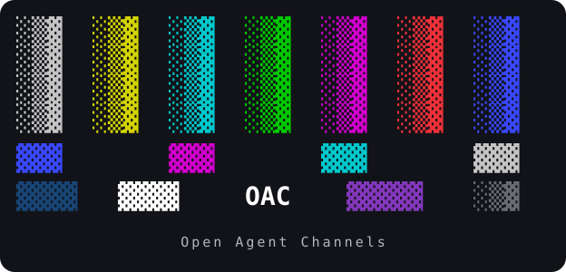

  

<strong>Messages between live AI harness sessions.</strong>

  <a href="https://github.com/RossGraeber/OAC/wiki">Wiki</a> ·
  <a href="docs/planning/STATUS.md">Project status</a> ·
  <a href="docs/planning/DESIGN.md">Design</a> ·
  <a href="https://github.com/RossGraeber/OAC/issues">Issues</a> ·
  <a href="https://github.com/RossGraeber/OAC/wiki/Tooling-and-Credits">Tooling &amp; credits</a>

  
  

## What is OAC?

**Open Agent Channels (OAC)** is a project to define provider-neutral **OAC Session
Channels**: direct, two-way messages between sessions of existing AI harnesses.
Each harness keeps responsibility for its own inference, authentication, context,
tools, and policy.

The intended flow is simple: an OAC-enabled Claude Code session sends a message to
an OAC-enabled Codex session; the receiving harness gets active input and can reply.
The [architecture and boundaries](docs/planning/ADR-001.md) define that goal.
Sessions must be launched OAC-enabled; arbitrary running sessions are outside the
supported integration model.

## Where the project stands

**Research and validation, before a released CLI.** The repository currently holds
the planning package, decisions, gate evidence, and development tooling.
The [status ledger](docs/planning/STATUS.md#current-stage) records Stage 1:
provider and transport spikes. G1–G4 have PASS verdicts; G5 provenance has a Codex
FAIL, with a revised framing design and a re-run pending. These are individual
spike results, not a completed end-to-end product.

Start with the [getting started guide](https://github.com/RossGraeber/OAC/wiki/Getting-Started) to explore
the evidence and contribute. Installation and launch commands in planning documents
are proposed interfaces, not instructions for an available release.

## Designed around

- **Active delivery:** push messages into OAC-enabled sessions, with replies and correlation.
- **Harness independence:** provider adapters behind a neutral messaging contract.
- **Transport independence:** Zenoh is the planned first reference transport.
- **Explicit trust:** authenticated sender identity, authorization, and untrusted message content.
- **Local CLI use:** the design does not require a cloud account or separately administered server for normal local operation.

See the [design](docs/planning/DESIGN.md), [security plan](docs/planning/v0.1/06-security.md),
and [deferred scope](docs/planning/v0.1/12-deferred.md) for the details.

## Communication

The planned message flow is harness → adapter → local daemon → transport → receiving
daemon → adapter → harness. Sessions on one device share the daemon. Messages target
opaque session IDs and carry text, reply correlation, freshness, and signed security
fields. Active delivery uses native harness input rather than inbox polling.

Receipts distinguish adapter acceptance from being handed to the harness. Neither
proves that the model read the message or completed a task. Exactly-once delivery and
durable offline mailboxes are not promised.
Read [communication details](https://github.com/RossGraeber/OAC/wiki/Communication)
for addressing, discovery, replies, failures, and deployment.

## Security

The design combines device-key signatures, replay checks, authenticated local IPC,
encrypted transport, and default-deny session allowlists scoped by working directory.
Pairing trusts a device key; separate grants authorize particular sessions.
Each harness keeps its own provider credentials.

**Authenticated messages remain untrusted content.** Delivery permission does not
grant tool approval or active-turn control. Permission relay is off by default in
the v0.1 plan, and machine-set provenance must stay separate from message text.
G5 exposed a Codex provenance failure; the revised design still needs its re-run.
Full end-to-end encryption is deferred, and replay suppression has a restart gap.
Read [security details](https://github.com/RossGraeber/OAC/wiki/Security) for trust
boundaries, controls, current evidence, and residual risks.

## Explore the docs

| Start here | What you will find |
|---|---|
| [📖 Wiki](https://github.com/RossGraeber/OAC/wiki) | Overview and guided navigation |
| [🧭 Getting started](https://github.com/RossGraeber/OAC/wiki/Getting-Started) | Repository orientation and contributor checks |
| [🏗️ Architecture](https://github.com/RossGraeber/OAC/wiki/Architecture) | Layers, scope, and trust boundaries |
| [🧪 Gate evidence](docs/planning/gates/README.md) | Recorded provider and transport experiments |
| [🛠️ Tooling & credits](https://github.com/RossGraeber/OAC/wiki/Tooling-and-Credits) | herdr, upstream projects, licenses, and their roles |
| [📺 Brand assets](docs/assets/README.md) | Character-art logo for documentation and terminals |

## Contribute

Pick an [issue](https://github.com/RossGraeber/OAC/issues), read its **Skills:** line, and check the
[current stage](docs/planning/STATUS.md) before starting implementation.
[AGENTS.md](AGENTS.md) explains repository guidance; [ADR-001](docs/planning/ADR-001.md)
sets the architectural boundaries. Include evidence for provider behavior and keep
unverified findings explicit.

## Credits and license

Thanks to the projects making this research possible, especially
[herdr](https://github.com/herdrdev/herdr) for development and test automation.
[Tooling & credits](https://github.com/RossGraeber/OAC/wiki/Tooling-and-Credits) explains each project's role;
[the dependency inventory](docs/planning/v0.1/07-repository-and-dependencies.md)
records the detailed license evidence.

OAC is licensed under [Apache-2.0](LICENSE). Third-party projects retain their own
licenses and trademarks. Project links acknowledge their work and do not imply endorsement.
